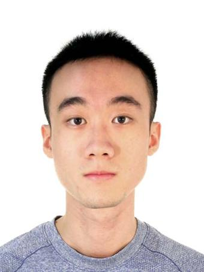
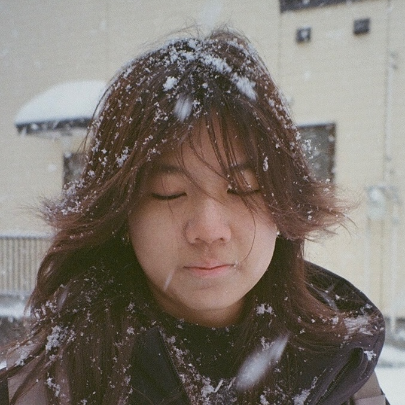

We are a team based in the [School of Computing, National University of Singapore](https://www.comp.nus.edu.sg).

You can reach us at the email `seer[at]comp.nus.edu.sg`

## Project team

### Kyra Choo

[[github](https://github.com/yellowbrickkode)]

* Role: Integration

### Chia Ping Yi Alston

[[github](https://github.com/Achiack)]

* Role: Code quality

### Yueqian Hong

[[github](http://github.com/hahaahaahh)]

* Role: Testing

### Yida Wang

[[github](https://github.com/WANG-YIDA)]

* Role: Deliverables and deadlines

### Celeste Phua

[[github](http://github.com/select-e)]

* Role: Documentation
