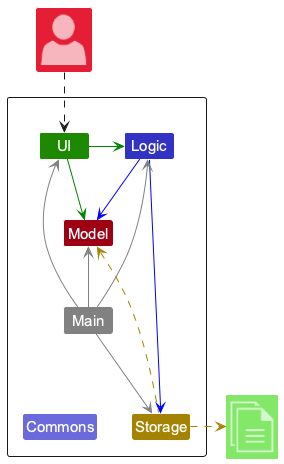
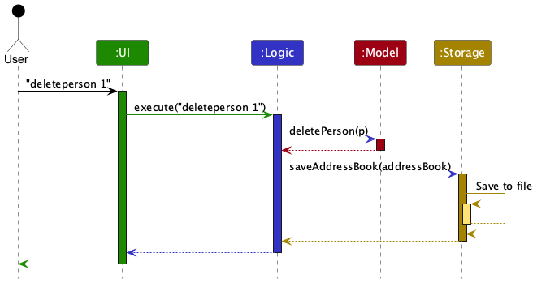
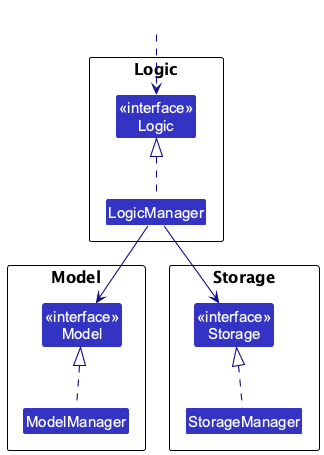
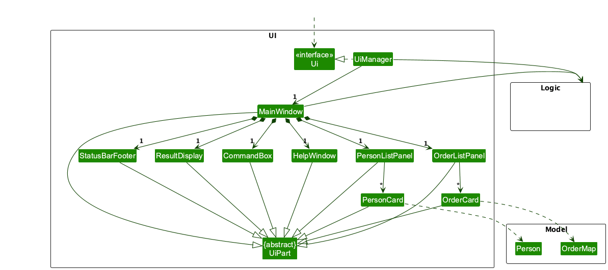
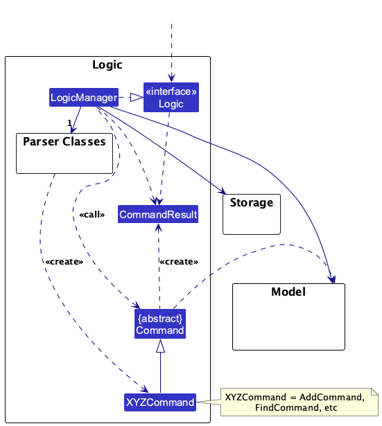
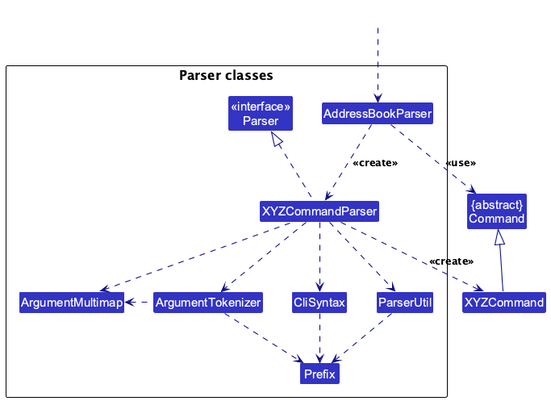
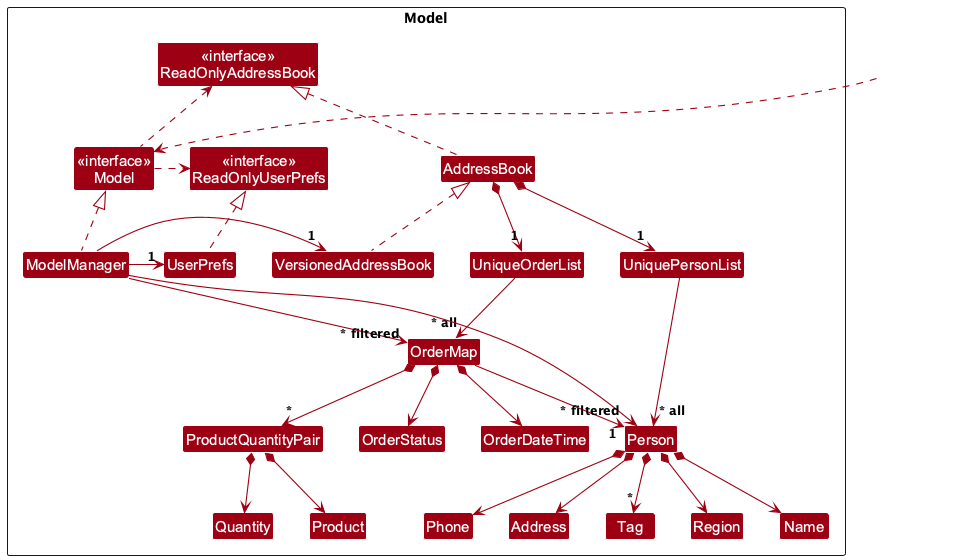
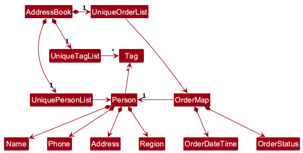
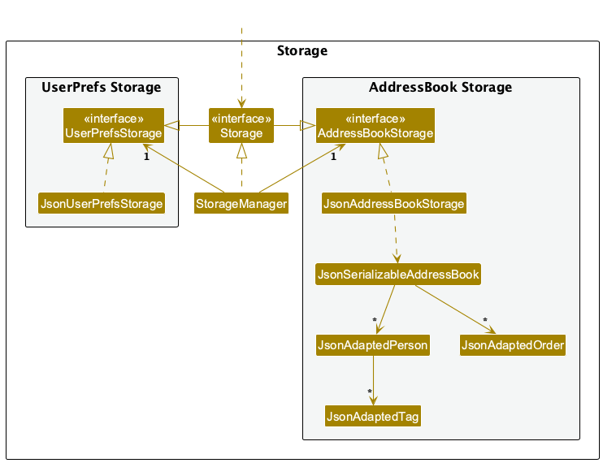

* Table of Contents
{:toc}

--------------------------------------------------------------------------------------------------------------------

## **Acknowledgements**

* Base project structure and several core patterns were adapted from [se-edu AddressBook-Level3 (AB3)](https://github.com/se-edu/addressbook-level3).
* Undo/redo state-management logic was reused and adapted from [se-edu AddressBook-Level4 (AB4)](https://github.com/se-edu/addressbook-level4), primarily in `VersionedAddressBook` and related model integration.
* Some JavaFX-related code ideas were adapted from Marco Jakob's tutorial: [JavaFX 8 Tutorial](http://code.makery.ch/library/javafx-8-tutorial/).
* Markdown rendering support uses the [CommonMark Java library](https://github.com/commonmark/commonmark-java), including `org.commonmark:commonmark` and `org.commonmark:commonmark-ext-gfm-tables`.
* Libraries used: JavaFX, Jackson, JUnit5.

--------------------------------------------------------------------------------------------------------------------

## **Setting up, getting started**

Refer to the guide [_Setting up and getting started_](SettingUp.md).

--------------------------------------------------------------------------------------------------------------------

## **Design**

:bulb: **Tip:** The `.puml` files used to create diagrams are in this document `docs/diagrams` folder. Refer to the [_PlantUML Tutorial_ at se-edu/guides](https://se-education.org/guides/tutorials/plantUml.html) to learn how to create and edit diagrams.

### Architecture

The ***Architecture Diagram*** given above explains the high-level design of the App.

Given below is a quick overview of the main components and how they interact with each other.

**Main components of the architecture**

**`Main`** (consisting of classes [`Main`](https://github.com/se-edu/addressbook-level3/tree/master/src/main/java/seedu/address/Main.java) and [`MainApp`](https://github.com/se-edu/addressbook-level3/tree/master/src/main/java/seedu/address/MainApp.java)) is in charge of the app launch and shut down.
* At app launch, it initializes the other components in the correct sequence, and connects them up with each other.
* At shut down, it shuts down the other components and invokes cleanup methods where necessary.

The bulk of the app's work is done by the following four components:

* [**`UI`**](#ui-component): The UI of the App.
* [**`Logic`**](#logic-component): The command executor.
* [**`Model`**](#model-component): Holds the data of the App in memory.
* [**`Storage`**](#storage-component): Reads data from, and writes data to, the hard disk.

[**`Commons`**](#common-classes) represents a collection of classes used by multiple other components.

**How the architecture components interact with each other**

The *Sequence Diagram* below shows how the components interact with each other for the scenario where the user issues the command `deleteperson 1`.

Each of the four main components (also shown in the diagram above),

* defines its *API* in an `interface` with the same name as the Component.
* implements its functionality using a concrete `{Component Name}Manager` class, which follows the corresponding API `interface` mentioned in the previous point.

For example, the `Logic` component defines its API in the `Logic.java` interface and implements its functionality using the `LogicManager.java` class, which follows the `Logic` interface. Other components interact with a given component through its interface rather than the concrete class (reason: to prevent outside components from being coupled to the implementation of a component), as illustrated in the (partial) class diagram below.

The sections below give more details of each component.

### UI component

The **API** of this component is specified in [`Ui.java`](https://github.com/se-edu/addressbook-level3/tree/master/src/main/java/seedu/address/ui/Ui.java)

The UI consists of a `MainWindow` that is made up of parts, e.g., `CommandBox`, `ResultDisplay`, `PersonListPanel`, `OrderListPanel`, `StatusBarFooter`, etc. All these, including the `MainWindow`, inherit from the abstract `UiPart` class, which captures the commonalities between classes that represent parts of the visible GUI.

The `UI` component uses the JavaFX UI framework. The layout of these UI parts is defined in matching `.fxml` files in the `src/main/resources/view` folder. For example, the layout of the `MainWindow` is specified in `MainWindow.fxml`.

The `UI` component,

* executes user commands using the `Logic` component.
* listens for changes to `Model` data so that the UI can be updated with the modified data.
* keeps a reference to the `Logic` component, because the `UI` relies on the `Logic` to execute commands.
* depends on some classes in the `Model` component, as it displays `Person` object residing in the `Model`.

### Logic component

**API** : [`Logic.java`](https://github.com/se-edu/addressbook-level3/tree/master/src/main/java/seedu/address/logic/Logic.java)

Here's a (partial) class diagram of the `Logic` component:

The sequence diagram below illustrates the interactions within the `Logic` component, taking `execute("deleteperson 1")` API call as an example.

:information_source: **Note:** The lifeline for `DeletePersonCommandParser` should end at the destroy marker (X) but due to a limitation of PlantUML, the lifeline continues till the end of diagram.

How the `Logic` component works:

1. When `Logic` is called upon to execute a command, it is passed to an `AddressBookParser` object which in turn creates a parser that matches the command (e.g., `DeletePersonCommandParser`) and uses it to parse the command.
1. This results in a `Command` object (more precisely, an object of one of its subclasses e.g., `DeletePersonCommand`) which is executed by the `LogicManager`.
1. The command can communicate with the `Model` when it is executed (e.g. to delete a person). 
   Note that although this is shown as a single step in the diagram above (for simplicity), in the code it can take several interactions (between the command object and the `Model`) to achieve.
1. The result of the command execution is encapsulated as a `CommandResult` object which is returned back from `Logic`.

Here are the other classes in `Logic` (omitted from the class diagram above) that are used for parsing a user command:

How the parsing works:
* When called upon to parse a user command, the `AddressBookParser` class creates an `XYZCommandParser` (`XYZ` is a placeholder for the specific command name, e.g., `AddPersonCommandParser`) which uses the other classes shown above to parse the user command and create a `XYZCommand` object (e.g., `AddPersonCommand`), which the `AddressBookParser` returns as a `Command` object.
* All `XYZCommandParser` classes (e.g., `AddPersonCommandParser`, `DeletePersonCommandParser`, ...) inherit from the `Parser` interface so that they can be treated similarly where possible, e.g., during testing.

### Model component
**API** : [`Model.java`](https://github.com/se-edu/addressbook-level3/tree/master/src/main/java/seedu/address/model/Model.java)

The `Model` component,

* stores the address book data i.e., all `Person` objects (which are contained in a `UniquePersonList` object) and all `OrderMap` objects (which are contained in a `UniqueOrderList` object).
* stores the currently 'selected' `Person` objects (e.g., results of a search query) as a separate _filtered_ list, which is exposed to outsiders as an unmodifiable `ObservableList<Person>` that can be observed. For example, the UI can be bound to this list so that it automatically updates when the data in the list change.
* stores the currently 'selected' `OrderMap` objects (e.g., results of a search query) as a separate _filtered_ list, which is exposed to outsiders as an unmodifiable `ObservableList<OrderMap>` that can be observed. For example, the UI can be bound to this list so that it automatically updates when the data in the list change.
* stores a `UserPrefs` object that represents the user’s preferences. This is exposed to the outside as a `ReadOnlyUserPrefs` object.
* does not depend on any of the other three components (as the `Model` represents data entities of the domain, they should make sense on their own without depending on other components).

:information_source: **Note:** An alternative (arguably, a more OOP) model is given below. It has a `Tag` list in the `AddressBook`, which `Person` references. This allows `AddressBook` to only require one `Tag` object per unique tag, instead of each `Person` needing their own `Tag` objects. 

### Storage component

**API** : [`Storage.java`](https://github.com/se-edu/addressbook-level3/tree/master/src/main/java/seedu/address/storage/Storage.java)

The `Storage` component,
* can save both address book data and user preference data in JSON format and read them back into corresponding objects.
* inherits from both `AddressBookStorage` and `UserPrefsStorage`, which means it can be treated as either one (if only one set of functionality is needed).
* depends on some classes in the `Model` component (because the `Storage` component's job is to save/retrieve objects that belong to the `Model`).

### Common classes

Classes used by multiple components are in the `seedu.address.commons` package.

--------------------------------------------------------------------------------------------------------------------

## **Documentation, logging, testing, configuration, DevOps**

* [Documentation guide](Documentation.md)
* [Testing guide](Testing.md)
* [Logging guide](Logging.md)
* [Configuration guide](Configuration.md)
* [DevOps guide](DevOps.md)

--------------------------------------------------------------------------------------------------------------------

## **Appendix: Requirements**

### Product scope

**Target user profile**:

This product is for delivery workers of a restaurant in Central Singapore.

**Value proposition**:

Our platform streamlines logistics by tagging orders by region for efficient batch lookups and completion workflows. While the app identifies customers within the same area for convenience, it does not provide specific route planning for delivery workers.

### User stories

**Requirements implemented in the current version**

The user stories below reflect features that are implemented in the current system and are aligned with the actual command behavior and use cases.

**Requirements yet to be implemented**

The planned user stories and the Planned Enhancements appendix describe near-future changes we intend to add in upcoming iterations.

**Implemented user stories (current version)**

Priorities: High (must have) - `* * *`, Medium (nice to have) - `* *`, Low (unlikely to have) - `*`

| Priority | As a …​                | I want to …​                                           | So that I can…​                                                     |
| ------ |---------------------------|-----------------------------------------------------------|------------------------------------------------------------------------|
| `* * *` | user                      | add a person with name, phone, address, and region        | store customer details for future orders.                             |
| `* * *` | user                      | edit a person’s details                                  | keep customer information accurate.                                   |
| `* * *` | user                      | delete a person by index                                 | remove customers who no longer order.                                 |
| `* * *` | user                      | list all persons                                         | view all customers in the system.                                     |
| `* * *` | user                      | add an order for an existing customer                    | record new orders without re-entering customer details.               |
| `* * *` | user                      | delete an order by index                                 | remove wrongly-keyed orders.                                          |
| `* *`  | user                      | delete orders by phone number                            | quickly remove all orders tied to a specific customer.                |
| `* * *` | restaurant employee       | mark an order as completed                               | keep track of fulfilled orders.                                       |
| `* *`  | restaurant employee       | mark all orders in a region as completed                 | batch-complete deliveries for the same area.                          |
| `* *`  | restaurant employee       | clear all orders                                         | reset the order queue quickly when needed.                            |
| `* *`  | restaurant delivery worker| find persons by region                                   | identify customers in a delivery region.                              |
| `* *`  | restaurant delivery worker| find active orders by phone or region                    | filter orders for delivery planning.                                  |
| `* *`  | restaurant delivery worker| list current and past orders                             | separate active orders from completed ones.                           |
| `* *`  | user                      | undo or redo recent changes                              | recover from accidental edits or deletions.                           |

### Use cases

(For all use cases below, the **System** is the `Food Bridge` and the **Actor** is the `user`, unless specified otherwise)

**Use case: Add an order for an existing customer**

**MSS**

1. User requests to add an order with a customer index and one or more order items.
2. Food Bridge creates the order and adds it to the order list.
3. Food Bridge shows the updated order list.

   Use case ends.

**Extensions**

* 1a. The customer index is missing or not a positive integer.
  * 1a1. Food Bridge shows an error message.
  * Use case resumes at step 1.

* 1b. Any order item is invalid (e.g., malformed `o/` input).
  * 1b1. Food Bridge shows an error message.
  * Use case resumes at step 1.

* 2a. The customer index is out of range.
  * 2a1. Food Bridge shows an error message.
  * Use case resumes at step 1.

**Use case: Find active orders by phone or region**

**MSS**

1. User requests to find active orders with `p/PHONE` or `r/REGION`.
2. Food Bridge filters the active orders and shows the matching list.

   Use case ends.

**Extensions**

* 1a. Both `p/` and `r/` are provided.
  * 1a1. Food Bridge shows an error message indicating only one prefix is allowed.
  * Use case resumes at step 1.

* 1b. The phone number or region value is invalid.
  * 1b1. Food Bridge shows an error message for the invalid value.
  * Use case resumes at step 1.

**Use case: Mark an order as completed**

**MSS**

1. User requests to complete an order by index.
2. Food Bridge marks the order as completed.
3. Food Bridge shows the updated order list.

   Use case ends.

**Extensions**

* 1a. The index is invalid or out of range.
  * 1a1. Food Bridge shows an error message.
  * Use case resumes at step 1.

* 2a. The order is already completed.
  * 2a1. Food Bridge shows an error message.
  * Use case resumes at step 1.

**Use case: Undo/redo a command**

**MSS**

1. User requests to undo or redo the last command.
2. Food Bridge updates the data to the previous/next state.
3. Food Bridge shows the updated list view.

   Use case ends.

**Extensions**

* 1a. There is no command to undo/redo.
  * 1a1. Food Bridge shows an error message.
  * Use case ends.

**Use case: Clear all orders**

**MSS**

1.  User requests to clear all orders.
2.  Food Bridge removes all orders from the order list.
3.  Food Bridge shows the list of orders.

    Use case ends.

**Extensions**

* 2a. The order list is already empty.

    * 2a1. Food Bridge shows a message that there are no orders to clear.

      Use case ends.

### Non-Functional Requirements

1.  Should work on any _mainstream OS_ as long as it has Java `17` or above installed.
2.  Should be able to hold up to 1000 persons without a noticeable sluggishness in performance for typical usage.
3.  A user with above average typing speed for regular English text (i.e. not code, not system admin commands) should be able to accomplish most of the tasks faster using commands than using the mouse.
4.  The application must be able to function completely offline as a standalone executable .jar file, without requiring a connection to an external database or the internet.
5.  The system should handle malformed commands (e.g., a delivery worker typing a wrong region format) by providing clear, actionable error messages rather than crashing.
6.  The system should safeguard against data corruption. If the application is closed abruptly, previously saved order data must remain intact.
7.  The system should be designed so that adding a new region (e.g., expanding from Central Singapore to the East) or a new delivery status does not require modifying the core execution logic.
8.  The application must not upload customer addresses or order details to any external cloud service or third-party server. All data must remain strictly on the delivery worker's local machine.

### Glossary

* **Mainstream OS**: Windows, Linux, Unix, macOS
* **Contact**: An individual or business entity stored in the application for reference. In this project, a contact refers to a customer.
* **Orders**: In this project, customer orders are stored in a different list than the contact list.
* **Region Tag**: A geographical area used to categorise delivery locations. In this project, region refers specifically to one of the following values: North, North-East, West, East, Central.

--------------------------------------------------------------------------------------------------------------------

## **Appendix: Instructions for manual testing**

Given below are instructions to test the app manually.

:information_source: **Note:** These instructions only provide a starting point for testers to work on;
testers are expected to do more *exploratory* testing.

### Launch and shutdown

1. Initial launch

   1. Download the jar file and copy into an empty folder

   1. Double-click the jar file. 
      Expected: Shows the GUI with a set of sample contacts. The window size may not be optimum.

1. Saving window preferences

   1. Resize the window to an optimum size. Move the window to a different location. Close the window.

   1. Re-launch the app by double-clicking the jar file. 
       Expected: The most recent window size and location is retained.

### Viewing the Help Page
1. Viewing the help page
   1. Test case: `help` 
      Expected: A new window opens showing the help page.

### Adding a person

1. Adding a person while all customers are being shown
   1. Prerequisites: List all customers using the `listperson` command. Multiple customers in the list.
   2. Test case: `addperson n/John Doe p/98765432 a/111111 u/#01-01 r/N` 
      Expected: New contact is added to the list. Details of the new contact shown in the status message.
   3. Test case: `addperson n/John Doe p/98765432` 
      Expected: No new contact is added. Error details shown in the status message. Status bar remains the same.
   
### Deleting a person

1. Deleting a person while all persons are being shown

   1. Prerequisites: List all persons using the `listperson` command. Multiple persons in the list.

   1. Test case: `deleteperson 1` 
      Expected: First contact is deleted from the list. Details of the deleted contact shown in the status message. Timestamp in the status bar is updated.

   1. Test case: `deleteperson 0` 
      Expected: No person is deleted. Error details shown in the status message. Status bar remains the same.

   1. Other incorrect delete commands to try: `deleteperson`, `deleteperson x`, `...` (where x is larger than the list size) 
      Expected: Similar to previous.

### Listing all persons
1. Listing all persons
   1. Prerequisites: App is launched with multiple persons in the list.
   2. Test case: `listperson` 
   Expected: All customers are displayed in the list.

### Editing a person
1. Editing a person with valid inputs
    1. Prerequisites: List all persons using the `listperson` command. Multiple persons in the list.
    2. Test case: `editperson 1 p/91234567 r/E` 
   Expected: First person’s phone number and region are updated.
    3. Test case: `editperson 2 n/Betsy Crower t/` 
   Expected: Second person’s name is updated and all tags are cleared.
    4. Test case: `editperson 3 a/123456 u/` 
     Expected: Third person’s address is updated and unit is cleared.
2. Editing a person with invalid inputs 
    1. Test case: `editperson 0 n/John` 
    Expected: No person is edited. Error message shown.
    2. Test case: `editperson 1 p/123` 
    Expected: No change. Error message due to invalid phone number.
    3. Other incorrect commands to try:
    `editperson`, `editperson x`, `editperson 1` 
    Expected: Similar to above.

### Finding persons by region
1. Finding persons with valid regions
    1. Prerequisites: List contains persons from different regions.
    2. Test case: `findperson N` 
    Expected: Persons in region N are displayed.
    3. Test case: `findperson N NE` 
    Expected: Persons in region N and NE are displayed.
2. Finding persons with invalid input
    1. Test case: `findperson X` 
    Expected: No persons found or error message shown.

### Adding an order
1. Adding an order with valid inputs
    1. Prerequisites: At least one person exists.
    2. Test case: `addorder c/1 o/2 5` 
    Expected: Order is added for customer 1.
    3. Test case: `addorder c/2 o/1 1 o/2 3 o/4 2` 
    Expected: Multiple items added to the order.
2. Adding an order with invalid inputs
    1. Test case: `addorder c/0 o/1 1` 
    Expected: No order added. Error message shown.
    2. Other incorrect commands to try:
    `addorder`, `addorder c/x`, `addorder c/1` 
    Expected: Similar to above.

### Deleting an order
1. Deleting an order
    1. Prerequisites: List all orders using `listorder`. Multiple orders exist.
    2. Test case: `deleteorder 1` 
    Expected: First order is deleted.
    3. Test case: `deleteorder 0` 
    Expected: No order deleted. Error message shown.
    4. Other incorrect commands to try:
    `deleteorder`, `deleteorder x`, `deleteorder 999` 
    Expected: Similar to above.

### Listing all orders
1. Listing all orders
    1. Prerequisites: Orders exist in the system.
    Test case: `listorder` 
    Expected: All orders are displayed.

### Editing an order
1. Editing an order with valid inputs
    1. Prerequisites: List all orders using listorder.
    2. Test case: `editorder 1 o/1 1 o/2 4` 
    Expected: Order is updated with new quantities.
    3. Test case: `editorder 2 o/2 0` 
    Expected: Menu item 2 is removed from the order.
2. Editing an order with invalid inputs
    1. Test case: `editorder 0 o/1 1` 
    Expected: No changes made. Error shown.
    2. Other incorrect commands:
    `editorder`, `editorder x`, `editorder 1` 
    Expected: Similar to above.

### Finding order by region
1. Finding orders with valid regions
    1. Prerequisites: List contains orders from different regions.
    2. Test case: `findorder r/N` 
    Expected: Orders in region N are displayed.

### Finding order by phone number
1. Finding orders with valid phone numbers
    1. Prerequisites: List contains orders from different customers.
    2. Test case: `findorder p/98765432` 
    Expected: Orders for customer with phone number 98765432 are displayed.

### Mark an order as completed
1. Marking an order as completed
    1. Prerequisites: List all orders using the `listorder` command. Multiple orders in the list.
    2. Test case: `complete 1` 
    Expected: First order is marked as completed. Status message reflects the update.
    3. Test case: `complete 0` 
    Expected: No order is updated. Error message shown.
    4. Other incorrect commands to try:
    `complete`, `complete x`, `complete 999` 
    Expected: Similar to above.

### Mark an order as completed by region
1. Marking orders as completed by region
    1. Prerequisites: List all orders using the `listorder` command. Multiple orders from different regions in the list.
    2. Test case: `completeregion r/N` 
    Expected: All orders in region N are marked as completed. Status message reflects the update.
    3. Test case: `completeregion r/X` 
    Expected: No orders updated. Error message shown.

### Clearing all orders
1. Clearing the order list
    1. Prerequisites: Orders exist in the system.
    2. Test case: `clearorder` 
    Expected: All orders are removed from the order list. Status message confirms clearing.
    3. Test case: `clearorder` when order list is already empty 
    Expected: No change to the list. Application remains stable

### Undoing changes
1. Undo last action
    1. Prerequisites: Perform a modifying command (e.g. `deleteperson 1`).
    2. Test case: `undo` 
    Expected: Last change is reverted.
    3. Test case: `undo` repeatedly 
    Expected: Steps back through history until no more actions to undo.

### Redoing changes
1. Redo last undone action
    1. Prerequisites: Perform `undo` first.
    2. Test case: `redo` 
    Expected: Last undone action is reapplied.
    3. Test case: `redo` with no undo history 
    Expected: Error message shown.

### Clearing all entries
1. Clearing all data
    1. Prerequisites: App contains persons and/or orders.
    2. Test case: `clear` 
    Expected: All entries are removed.

### Exiting the program
1. Exiting the program
    1. Prerequisites: The applcation is running.
    2. Test case: `exit` 
    Expected: The application closes.

### Saving data

1. Dealing with missing/corrupted data files

   1. Prerequisites: The app has been launched at least once so that `data/addressbook.json` exists.
   2. Test case (missing file):
      1. Close the app.
      2. Delete `data/addressbook.json`.
      3. Launch the app.
      Expected: App starts successfully with sample data and recreates `data/addressbook.json`.
   3. Test case (corrupted file):
      1. Close the app.
      2. Replace `data/addressbook.json` contents with invalid JSON (e.g. `{ invalid json`).
      3. Launch the app.
      Expected: App starts successfully with empty data, logs a data loading warning, and does not crash.

2. Persistence after valid command execution

   1. Prerequisites: App is running.
   2. Test case: `addperson n/Test User p/91234567 a/123456 r/N`, then close and relaunch the app.
      Expected: The added contact is present after relaunch.

## **Appendix: Effort**

Compared with AB3, this project required substantially more effort in domain modeling and command behavior because we support multiple entity types (`Person` and `OrderMap`) and their interactions, rather than a single main entity.

The overall difficulty was moderate-to-high: beyond CRUD-style commands, we needed to maintain consistency between contact and order data, support additional filtering flows, and keep UI behavior intuitive when switching between person and order views.

Main challenges included designing data structures for orders (status, datetime, product-quantity pairs), preventing invalid cross-entity states, and updating parser/logic/model/UI layers in a synchronized way without regressions.

Estimated effort was front-loaded into architecture adaptation and integration testing, then shifted to incremental feature delivery and bug fixing. A significant portion of effort (well above 5%) was saved through reuse:
* AB3 scaffold and architecture conventions accelerated setup, component boundaries, and documentation style.
* AB4 undo/redo approach reduced implementation risk; our adaptation work is mainly in `VersionedAddressBook`, `ModelManager`, and undo/redo command integration.

Key achievements include extending the model to support orders with richer attributes, preserving clean layering across components, and delivering a working CLI-driven workflow for both contact and order management while keeping documentation and diagrams aligned with implementation.

--------------------------------------------------------------------------------------------------------------------

## **Appendix: Planned Enhancements**

Team size: 5

1. Pin important orders for faster access: Currently, orders are listed strictly by time and all orders look the same, so urgent orders can get buried in a long list. We will add a `pinorder INDEX` command that toggles a pinned flag on an existing order and a pin indicator on the order card (a small pin icon and the text `Pinned`). Pinned orders will appear in a dedicated pinned block at the top of the order list, while preserving their relative ordering by `orderDatetime`. The result display will confirm the pin toggle (e.g., `Order 3 pinned`).
2. Copy a customer’s phone number from an order card: Currently, users must manually select and copy the phone number, which is slow and error-prone when handling multiple deliveries. We will add a small copy button next to the customer phone line in the order card. Clicking it copies the phone number to the clipboard and shows a brief confirmation in the result display (e.g., `Copied phone number: 98765432`). If the clipboard is unavailable, the result display will show a clear error (e.g., `Unable to copy phone number: clipboard unavailable`) and the UI will remain unchanged.
3. Show only orders due for delivery today on app launch: Currently, the app shows all orders on startup, which can overwhelm the user when only today’s deliveries matter. We will apply a startup filter that shows only orders whose `orderDatetime` falls on the current local date, and display a one-line hint in the result display (e.g., `Showing orders for today (2026-04-08)`). Users can clear the filter with `listorder`, which restores the full order list. The filter is read-only and does not modify stored order data.
4. Alert when adding an identical contact: Currently, adding a person who already exists may either succeed or fail with a generic duplicate message, leaving the user unclear about what is duplicated. We will detect an exact duplicate (same name, phone, address, region, tags) and show a specific error: `Contact Amy Lee already exists with the same details.` This will not block partially matching contacts (e.g., same name but different phone), which will continue to be allowed.

--------------------------------------------------------------------------------------------------------------------

