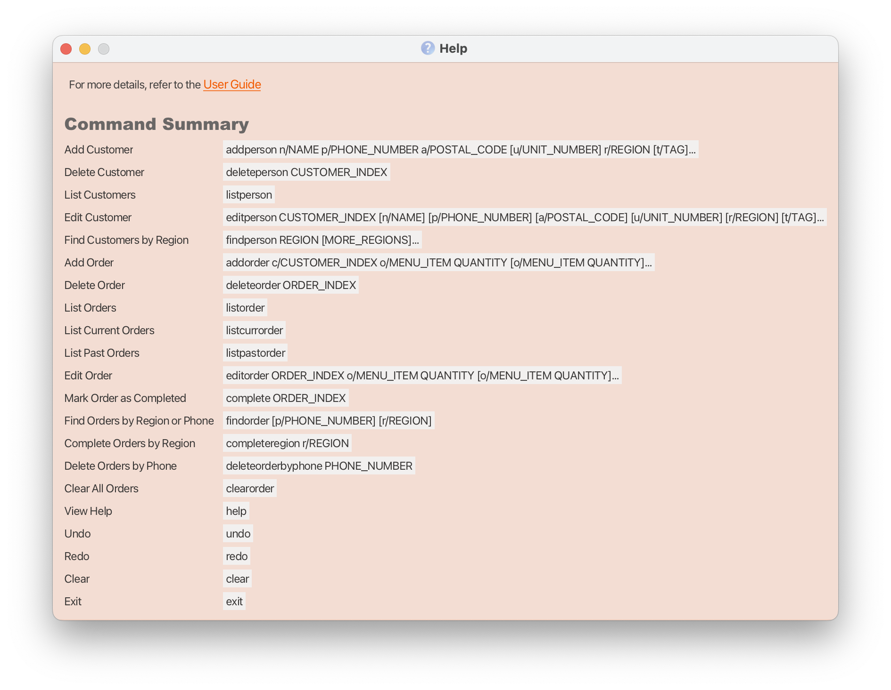

Food Bridge is a **desktop app for managing contacts and orders for restaurants, optimized for use via a Command Line Interface** (CLI) while still having the benefits of a Graphical User Interface (GUI).

* Table of Contents
{:toc}

--------------------------------------------------------------------------------------------------------------------

## Quick start

1. Ensure you have Java `17` or above installed in your Computer. 
   **Mac users:** Ensure you have the precise JDK version prescribed [here](https://se-education.org/guides/tutorials/javaInstallationMac.html).

1. Download the latest `.jar` file from [here](https://github.com/AY2526S2-CS2103T-T12-4/tp/releases).

1. Copy the file to the folder you want to use as the _home folder_ for your Food Bridge Application.

1. Open a command terminal, `cd` into the folder you put the jar file in, and use the `java -jar food-bridge-[version].jar` command to run the application. 
   A GUI similar to the below should appear in a few seconds. Note how the app contains some sample data. 
   

1. Type the command in the command box and press Enter to execute it. e.g. typing **`help`** and pressing Enter will open the help window. 
   Some example commands you can try:

   * `list` : Lists all contacts.

   * `addperson n/John Doe p/98765432 a/111111 u/#01-01 r/N` : Adds a contact named `John Doe` to the Address Book.

   * `delete 3` : Deletes the 3rd contact shown in the current list.

   * `clear` : Deletes all contacts.

   * `exit` : Exits the app.

1. Refer to the [Features](#features) below for details of each command.

--------------------------------------------------------------------------------------------------------------------

## Features

**:information_source: Notes about the command format:** 

* Words in `UPPER_CASE` are the parameters to be supplied by the user. 
  e.g. in `add n/NAME`, `NAME` is a parameter which can be used as `add n/John Doe`.

* Items in square brackets are optional. 
  e.g `n/NAME [t/TAG]` can be used as `n/John Doe t/friend` or as `n/John Doe`.

* Items with `…`​ after them can be used multiple times including zero times. 
  e.g. `[t/TAG]…​` can be used as ` ` (i.e. 0 times), `t/friend`, `t/friend t/family` etc.

* Parameters can be in any order. 
  e.g. if the command specifies `n/NAME p/PHONE_NUMBER`, `p/PHONE_NUMBER n/NAME` is also acceptable.

* Extraneous parameters for commands that do not take in parameters (such as `help`, `list`, `exit` and `clear`) will be ignored. 
  e.g. if the command specifies `help 123`, it will be interpreted as `help`.

* If you are using a PDF version of this document, be careful when copying and pasting commands that span multiple lines as space characters surrounding line-breaks may be omitted when copied over to the application.

### Viewing help : `help`

Shows a message explaining how to access the help page.

Format: `help`

### Adding a person: `addperson`

Adds a person to the address book.

Format: `addperson n/NAME p/PHONE_NUMBER a/POSTAL_CODE [u/UNIT_NUMBER] r/REGION [t/TAG]…​`

:bulb: **Tip:**
A person can have any number of tags (including 0)

Examples:
* `addperson n/John Doe p/98765432 a/111111 u/#01-01 r/N`
* `addperson n/Betsy Crowe p/87243155 a/110022 r/C t/loyal customer`

### Deleting a person : `deleteperson`

Deletes the specified person from the person list.

Format: `deleteperson INDEX`

* Deletes the person at the specified `INDEX`.
* The index refers to the index number shown in the displayed person list.
* The index **must be a positive integer** 1, 2, 3, …​

Examples:
* `deleteperson 2` deletes the 2nd person in the person list.
* `find N` followed by `deleteperson 1` deletes the 1st person in the results of the `find` command.

### Listing all persons : `listperson`

Shows a list of all persons in the contact list.

Format: `listperson`

### Editing a person : `editperson`

Edits an existing person in the person list.

Format: `editperson INDEX [n/NAME] [p/PHONE_NUMBER] [a/ADDRESS] [u/UNIT] [r/REGION] [t/TAG]…​`

* Edits the person at the specified `INDEX`. The index refers to the index number shown in the displayed person list.
* At least one of the optional fields must be provided.
* Existing values will be updated to the input values.

Editing tags:
* When editing tags, the existing tags of the person will be removed i.e adding of tags is not cumulative.
* You can remove all the person’s tags by typing `t/` without
    specifying any tags after it.

| Parameter      | Format requirements                                             |
|----------------|-----------------------------------------------------------------|
| `INDEX`        | Must be a positive integer, e.g. 1, 2, 3, …​                    |
| `PHONE_NUMBER` | Must be exactly 8 digits long and start with either 6, 8, or 9. |
| `ADDRESS`      | Must be a 6-digit postal code.                                  |
| `UNIT`         | Must be in the form `#XX-XX`, where `X` is a digit.             |
| `REGION`       | Must be one of: `N`, `NE`, `W`, `E`, `C`.                       |

Examples:
*  `editperson 1 p/91234567 r/E` Edits the phone number and region of the 1st person in the list to be `91234567` and `East` respectively.
*  `editperson 2 n/Betsy Crower t/` Edits the name of the 2nd person to be `Betsy Crower` and clears all existing tags.
* `editperson 3 a/123456 u/` Edits the postal code of the 3rd person to be `123456` and clears the existing unit number.

### Locating people by region: `findperson`

Finds people whose regions match any of the given keywords.

Format: `findperson KEYWORD [MORE_KEYWORDS]`

* The search is case-insensitive. e.g. `n` will match `N`
* The order of the keywords does not matter. e.g. `NE W` will match both `W` and `NE`
* Valid region keywords are: `N`, `NE`, `W`, `E`, `C`
* Only full region words will be matched. e.g. `N` will not match `NE`
* Persons matching at least one keyword will be returned (i.e. `OR` search).
  e.g. `N E` will return persons in either `N` or `E`

Examples:
* `findperson N` returns persons in region `N`
* `findperson NE W` returns persons in region `NE` or `W`

### Adding an order: `addorder`

Adds an order to the address book.

Format: `addorder c/CUSTOMER_INDEX o/MENU_ITEM QUANTITY_ORDERED…​`

:bulb: **Tip:**
A person can have any number of orders (excluding 0)

Examples:
* `addorder c/1 o/2 5`
* `addorder c/2 o/1 1 o/2 3 o/4 2`

### Deleting an order : `deleteorder`

Deletes the specified order from the order list.

Format: `deleteorder INDEX`

* Deletes the order at the specified `INDEX`.
* The index refers to the index number shown in the displayed order list.
* The index **must be a positive integer** 1, 2, 3, …​

Examples:
* `deleteorder 3` deletes the 3rd order in the order list.

### Listing all orders : `listorder`

Shows a list of all orders in the order list.

Format: `listorder`

### Editing an order : `editorder`

Edits an existing order in the order list.

Format: `editorder INDEX o/MENU_ITEM PRODUCT_QUANTITY…​`

* Edits the order at the specified `INDEX`. The index refers to the index number shown in the displayed order list.
* Existing menu item selections will be updated to the input values.

Examples:
*  `editorder 1 o/1 1 o/2 4` Edits the 1st order in the list to include 1 of menu item 1 and 4 of menu item 2.
*  `editorder 2 o/2 0` Edits the 2nd order to clear the selection of menu item 2.

### Undoing the last change : `undo`

Undoes the most recent change to the address book.

Format: `undo`

* Only commands that modify data can be undone.
* You can perform `undo` multiple times to step backwards through recent modifying commands until there is no more history to undo.

Examples:
* `deleteperson 2` followed by `undo` will restore the deleted 2nd person.

### Redoing the last undone change : `redo`

Redoes the most recently undone change.

Format: `redo`

* Works only if there is at least one previously undone change to redo; you can perform `redo` multiple times until the latest state is reached.
* If there is no undone change to redo, the command will fail.
* `redo` cannot be used after any new modifying command has been executed following an `undo` (the redo history is cleared when new changes are made).

Examples:
* `deleteperson 2` then `undo` then `redo` will delete the 2nd person again.

### Clearing all entries : `clear`

Clears all entries from the address book.

Format: `clear`

### Exiting the program : `exit`

Exits the program.

Format: `exit`

### Saving customer and order data

AddressBook data are saved in the hard disk automatically after any command that changes the data. There is no need to save manually.

### Updating the customer and order data file

AddressBook data are saved automatically as a JSON file `[JAR file location]/data/addressbook.json`. Advanced users are welcome to update data directly by editing that data file.

:exclamation: **Caution:**
If your changes to the data file makes its format invalid, AddressBook will discard all data and start with an empty data file at the next run. Hence, it is recommended to take a backup of the file before editing it. 
Furthermore, certain edits can cause the AddressBook to behave in unexpected ways (e.g., if a value entered is outside of the acceptable range). Therefore, edit the data file only if you are confident that you can update it correctly.

--------------------------------------------------------------------------------------------------------------------

## FAQ

**Q**: How do I transfer my data to another Computer? 
**A**: Install the app in the other computer and overwrite the empty data file it creates with the file that contains the data of your previous AddressBook home folder.

**Q**: Can I add multiple products in one order?
**A**: Yes. Use the `addorder` command and add as many orders you want with the `o/` prefix

**Q**: What happens if I delete a customer with existing orders?
**A**: Deleting a customer does not automatically delete their orders. This may result in orphaned orders.

--------------------------------------------------------------------------------------------------------------------

## Known issues

1. **When using multiple screens**, if you move the application to a secondary screen, and later switch to using only the primary screen, the GUI will open off-screen. The remedy is to delete the `preferences.json` file created by the application before running the application again.
2. **If you minimize the Help Window** and then run the `help` command (or use the `Help` menu, or the keyboard shortcut `F1`) again, the original Help Window will remain minimized, and no new Help Window will appear. The remedy is to manually restore the minimized Help Window.
3. **If you delete a contact**, it does not delete the orders associated with it, which may lead to inconsistent data.

--------------------------------------------------------------------------------------------------------------------

## Command summary

Action | Format, Examples
--------|------------------
**View Help** | `help`
**Add Contact** | `addperson n/NAME p/PHONE_NUMBER a/ADDRESS u/UNIT_NO r/REGION`   e.g., `addperson n/John Doe p/98765432 a/111111 u/#01-01 r/N`
**Delete Contact** | `deleteperson INDEX`  e.g., `deleteperson 3`
**List Contacts** | `listperson`
**Edit Contact** | `editperson INDEX [n/NAME] [p/PHONE_NUMBER] [e/EMAIL] [a/ADDRESS] [t/TAG]…​`  e.g.,`edit 2 n/James Lee e/jameslee@example.com`
**Find Region** | `find REGION`  e.g., `find N`
**Add Order** | `addorder c/CUSTOMER_INDEX o/MENU_ITEM QUANTITY_ORDERED…​`   e.g., `addorder c/1 o/2 5` `addorder c/2 o/1 1 o/2 3 o/4 2`
**Delete Order** | `deleteorder INDEX`  e.g., `deleteorder 3`
**Edit Order** | `editorder INDEX o/MENU_ITEM PRODUCT_QUANTITY…​`   e.g.,`editorder 1 o/1 1 o/2 4` `editorder 2 o/2 0`
**List Orders** | `listorder`
**Undo** | `undo`
**Redo** | `redo`
**Clear** | `clear`
**Exit** | `exit`
